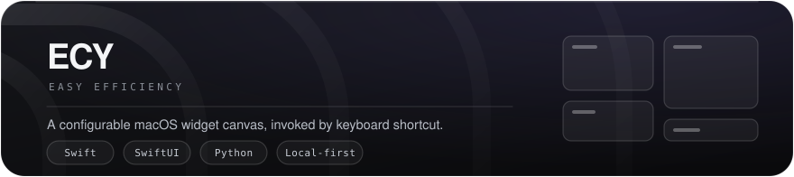
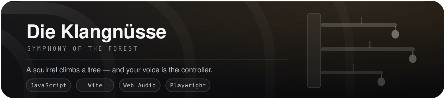
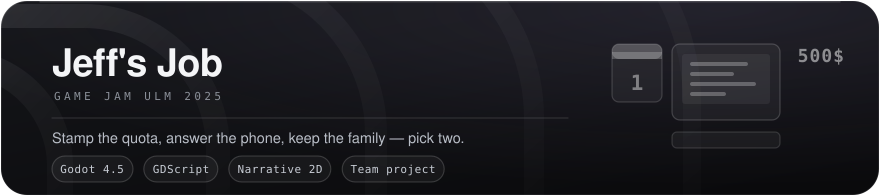

  

# Jeremy Hüring

<b>B.Sc. Software Engineering · University of Stuttgart · Germany</b>

  

 &nbsp; 

  

 

 

## Projects

  

Most menu-bar utilities give you *one* number in the corner and call it a day. **ECY** gives you a
canvas: one shortcut drops a full-screen frosted-glass overlay over whatever you're doing, with
every widget you care about sitting there as its own card on a 22×13 snap grid. Spotify, Reminders,
CPU, network, battery, Gmail triage, FX charts, flight prices, Claude Code usage — thirteen of them,
and each one also runs as an independent menu-bar app of its own. Local-first throughout: no
backend, no relay server, nothing phoning home.

<b>Swift · SwiftUI · Python · macOS 13+</b> — private repository

 

  

A pixel platformer played with your **voice**. Knut the squirrel climbs an endless tree and how
loud you are is the throttle — stay quiet and he creeps, shout and he jumps, while the arrow keys
only pick a direction. The camera ratchets upward and never comes back down, so falling out of
frame is death. Built at the Fraunhofer **Agent Coding Workshop**, where it placed **2nd**, and
since grown a shrine of nut-bought upgrades, a run logbook and seasonal canopies that swap in
mid-climb. Underneath: chunked procedural generation, seeded RNG, and a deterministic Playwright
suite that drives the game through the DOM — no microphone required to test it.

<b>JavaScript · Vite · Web Audio · Playwright</b> — [Die-Klangnuesse-2D-Platformer](https://github.com/sirJeremyer/Die-Klangnuesse-2D-Platformer)

 

  

**Jeff's Job** drops you into five days of a desk job, built with a team at **Game Jam Ulm 2025**.
Stamp the documents, send exactly the right number of emails, and pick up when your mother calls.
The quota ratchets every day — twenty stamps, then twenty-three, twenty-five, twenty-seven, thirty —
and each evening scores you in two currencies: money, and the hours you owe your family. Miss the
phone on day four and the recap just reads *"You didn't answer....DIVORCE"*. There are two endings,
and both of them are you leaving that desk.

<b>Godot 4.5 · GDScript · 2D narrative</b> — team project, [play it on itch.io](https://flizzie.itch.io/jeffs-job)

 

